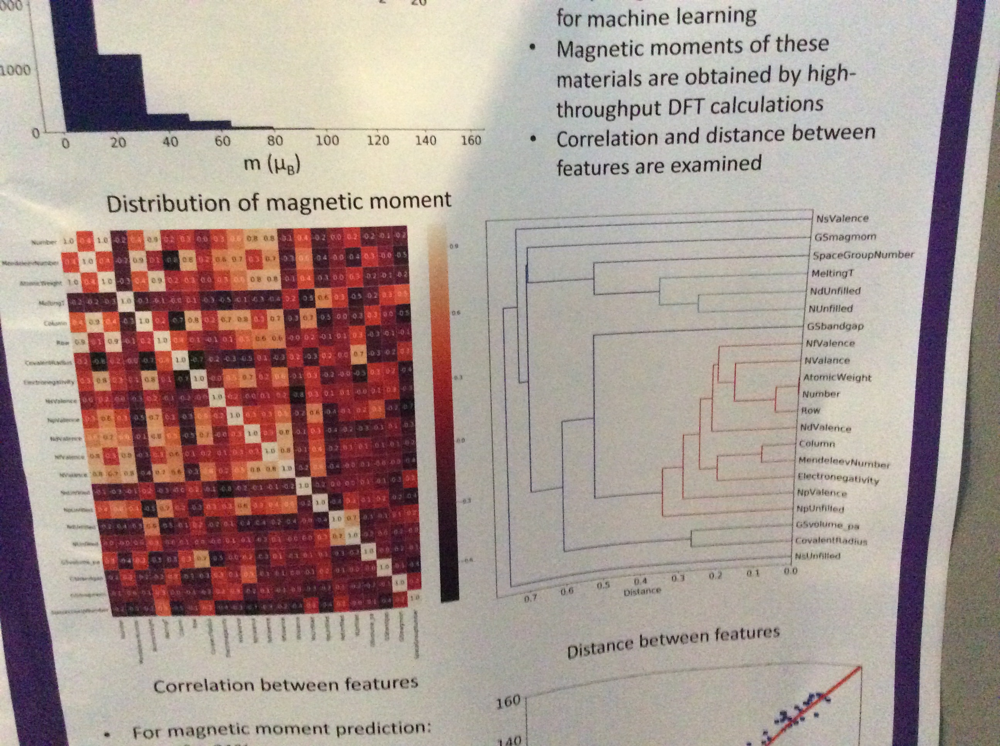

# ML4MS notes

## Resources to look up
- accessible mathematical introduction to machine learning (kernals etc): 
	- https://mml-book.github.io/
	- https://eta.impa.br/dl/PL019.pdf
	- https://www.inference.org.uk/itprnn/book.pdf
- general ML reading:
	- https://www.nature.com/articles/nphys4053
	- https://onlinelibrary.wiley.com/doi/full/10.1002/qua.24954
	- handbook for materials modelling (2018) chapter on ML: https://link.springer.com/content/pdf/10.1007%2F978-3-319-42913-7_68-1.pdf
	- Bomberelli chapter in same book above: https://link.springer.com/content/pdf/10.1007%2F978-3-319-42913-7_59-1.pdf
   
## Day One

### luca ghiringhelli, FHI, (SISSO)

- talk themes: compressed sensing / supervised learning / maps of material properties
- idea is to create maps of materials so that materials can be sorted into eg: ZB or rocksalt when given composition
- big picture: the preparaiton, synthesis, characterisation of materials is costly and complex, there are 240000 inorganic materials listed on Springer but most properties are not known
- the training --> descriptor --> learning --> prediction loop
- ML built on top of ab-initio calculations
- what does "big" mean? 4 V's: volume, velocity (cf. cern), variety, veracity

- usually we use ML when the laws are unknown. But in MS we know the laws! But the model is complex. So the ideas is to find descriptors which embed enough physical information so that the model itself is easy enough to solve.
- LG has an interest in course grained models: not where we worry about the exact positions of the atoms, but the topology (connectivity - what is connected to what)

- discussed points we have covered in group meetings: importance of training error & validation error to avoid under/over fitting, need for a diverse data set
- the main challenges are the descriptor, and getting a diverse data set.
- principal component analysis to find hte direction with the greatest variance (like finding long edge of cigar)

- LG gave a mathematical overview of ridge regression, kernal ridge regression, regularization - I need to re-visit slides to understand.
- key point: KRR uses a linear expansion of a non-linear kernal (equiv basis set?) so that we can get a non linear fit using linear algebra.

- to look up: 
   - nomad kaggle predicting TCO. The winner was a course grained model using a soap like descriptor + NN. The descriptor was a "dressed chemical species" - it showed that local topology can be more important that exact angles etc.
   - predicting xtal structure from composition: 82 data points for training set are possible if the correct descriptor and method is used.
   - 2014 PRB (Misner) - hole trapping depth
   - vidvudis ozilins  - use of compressed sensing and in 2013 cluster expansion "compressive sampling as a paradigm for building physics models"

### nong artrith columbia

- talk themes: MLPs for simulation of complex materials
- reference calc --> interpolate --> continuous PES --> MD, MC ets
- using neural nets for regression

- NNs are good for continuous functions
- The activation function
- A nice basic NN example - fitting a parabola

- ANN negatives:
  - can only be used for one number of atoms once trained
  - ANNs are not automatically invariant to rotation or exchange of identical atoms

- showed that to account for electrostatic interactions, can use longer ranged potentials (8-15A), as confirmed for oxides in PRB 2011 15310
- the Berhler-Parrinello descriptor : A-A, A-B (radial), AAA, AAB (angular) --> scales like N(N+1)/2 and not feasible for > 4 species
- discussed systematic construction of a training set (build prelimenary --> run MD --> compare to DFT)
- It is possible to validate system sizes beyond that which can be reached by DFT, through comparing forces on particular atoms
- the need for transferable formats for ANN potentials (interoperability, data)

- to look up:
  -  PRB 2017 Ceder Artrith: RDF and ADF are expanded as Chebyshev polynomials (after gaussian broadening) so that they form invariant descriptors for a battery material
  - ML for structural prediction and transport properties of amorphous N doped Li3PO4, an electrolyte: Lacivita et al 2018 chemistry of materials.
  - Artrith 2019 JPhysEnergy - good practice / sharing

## Day Two

### Tutorial notes

- in the data folder there is a large (~5000) structure set which can be used as we want
- unsupervised learning can be used for dimensionality reduction
- Dscribe package
- In reality you'd probably use tensorflow (and GPUs) rather than scikitlearn
- There is the use of randomness (see here for where it may creep in: https://machinelearningmastery.com/randomness-in-machine-learning/) which means that re-running with the *same* data and *same* hyperparameters means that different errors are gotten - I'm still not clear on how this should be reported in literature (average? over how many runs?)
- You can break NN with a very simple function: f=xy. 

## Day Three

### Michele Ceriotti: Part One

- talk themes: ML isn't just about building potentials!
- the general idea is that input/label pairs are fed to a learning scheme, tuned by hyperparameters, so that it can be used to perform tasks on new data.
- A kernel can be used ti neasure similarity between structures. Finite approximation to tihs gives a feature vector.
- In this talk will discuss results for KRR, which is one step beyond regression, as the focus in on the representation.
- KRR is a linear fit on a training set: E=\sumwK(A_j,A_i) where A_j and A_i are labels and K measures the similarity. K needs to be chosen, this is the only flexibility in the model. w is determined by inverting the kernel matrix ---> it all reduces to linear algebra.
- one of the benefits of ML in MS is that we have the underlying physics which provides a lot of constraints. This is not true for people trying to ML pictures of kittens!
- general principle I: should build symmetry of physical law into our approach.
- general principle II: should provide ML for insight, not just fancy interpolation

- we cannot represent structure using cartesian coordinates as they don't obey fundamental physical symmetries: exchange of identical atoms (permutational variance), rotation
- use symmetry adapted atom-density representations in the form of a dirac ket, which is independant of basis.
- to ensure invariance for a particular symmetry group we integrate over the symmetry group (I think this will be included in his book chapter pasted above, won't write maths here). It can be shown that this is equivalent to gaussian convolution. It leads to an atom centred representation.
- Imposing rotational invariance leads to a 3-body correlation function.
- The integrations are not done numerically, the density is represented using spherical harmonics so that analytic integration is possible.
- See Willatt JCP 2019 and Drautz PRB 2019 (from cluster expansion viewpoint)
- This approach assumes the the property you want to learn can be broken down into local contributions --> but not all properties we want to learn can be broken down into local contributions.
- Key pointL: Many of the kernels / descriptors used in ML4MS are different ways to represent the same object (only the basis function changes)

-  The learning curve is a useful diagnostic tool to explore the multiscale physics of a problem. For example, can re-plot learning curve as the degree of locality (cutoff radius) is changed. For example: 2A cutoff means that only covalent interactions can be learnt (Willat PCCP 2018).
- Reduction in descriptor space --> more efficient learning.

- ShiftML.org: machine learning of NMR chemical shifts
- AlphaML.org: machine learning of molecular polarizabilities
- in atom centred can do sensitivity analysis to see which atoms are most important
- fundamental point: we use overlap as this is a way to measure similarity (obvious when it's pointed out...)

### Michele Ceriotti: Part Two

- now dealing with less obvious symmetries.
- Forces are vectors, so the kernel must be a matrix (Glielmo PRB 2017)
- need to simplify so we can use the symmetries of a propert. Eg: tensor --> block diagonalise --> 5 components which transform like spherical harmonics.

- motivation: DFT is bad at response functions like the dielectric, we need to use coupled cluster but this is limited to small molecules. 
- ML model trained on CC beats DFT!

- various miscellaneous points:
	- if you are dealing with a non-additive property (non-local), map this onto an (approximate?) additive property
	- ask yourself if ML something indirectly (eg: energy from electron density) is better than learning it directly (eg: energy)
	- for the training set, uniformly cover - rand can be bad. Use farthest point sampling: sketchmap.org. The norm you use (eg:RMSE) will influence your choice of training set.
	- sparse kernel learning (eg: CUR) to find features which differ most greatly from each other can be useful for very high dimensions: don't need to load in the full matric unlike in PCA
	- should always publish with uncertainty estimators: JCTC 2019 Musil
	- this approach is inductivist at it's root so can be caught out (Turkey)

### Michael Sluydts

- talk themes: point defects and doping
- point defects can occupy various symmetrically inequivalent sites, take several forms (vacancy+interstital etc), and there are various possible atomic species to substitute in - the number of possibilities grows quickly
- high throughput shows that the DFE is smooth between elements: do we need to directly simulate everything? Try interpolation (ML)

- use a gaussian process model to fit an ensemble, a benefit is that it gives standard dev for uncertainty. don't use structural information as only using single structure (varying atomic species). the output is the hull energy.
- use active learning: DFT in --> gaussian process (mean, stdev) --> gives predictions and uncertainties so that you can see where to calculate next.

- move to deep learning to handle more complicated information (thermal disorder and defect migration), with geometry now as input. Use a radial basis function for geometry to calculate an atomic energy then sum these up to get the total energy. 
- deep active learning is difficult as the deep learning model is slower.
- using this model, data from 3 vacancies is used to simulate energy/forces on up to 13 vacancies in 216 atoms.
- because there is lots of configurational freedom in this problem, there is a lot of data needed

- there was a question about calculating vibrational properties using this approach but this wasn't really siezed upon. The forces are learnt directly!

### Poster session

- Interesting ways to visualise correlation and distance between features, apparently this appraoch is quite standard in ML field but not seen so much in materials science so far (presenter is from latter field)

 ## Day Four

 ### Bomberelli

 - talk themes: representation learning and physics-based priors for inverse design of materials
 - Motivation: we need new materials fast - remediation of damage already done
 - There is a continuum between ML and physics based modelling
 - ML positives: + fast, uses large data, negatives: only as good as training, can be difficult to access data
 - ML can help us to bypass calculations
 - what is often important is the multiscale aspect
 - An important starting point is to "know the space" - only way to gather data in a strategic way?
 - this overall approach has been shown for OLEDs and organic flow batteries
 - It is common to embed physics using features from first principles (radius, electronic srtuct etc) but they are not degree of freedom - it's not a knob you can twiddle. Better is to use end-to-end learning, starting with the most basic parameters as input - parameters which we can control (like atomic number)
 - but when there is less data available, embed prior knowledge of the physics
 - methodology is message passing neural nets
 - trial and error vs high throughput vs inverse design (nice schematic) 
 - generative means: can find new members of a distribution without knowing what the distribution itself is.
 - the importance of keeping it sensible: domain expertise
 - course graining: if there are atoms that move together, we can use a collective variable (super atom) to describe them
 - we can use ML to work out how best to course grain

### Karsten Jacobsen

- theme: finding new materials when you don't know where the atoms are
- key questions are: which properties? / how? / in what part of the materials space?
- eg: light induced water splitting. The important properties are band alignment, stability, band gap for absorption...
- use a screening funnel
- we can explore certain structural groups:
	- cubic perovskites: screening to match criteria above and only get 20 candidates incl. some previously known (which is nice!)
	- sulfide perovskites for ....
	- but we did many calculations that were not necessary. Is there a cleverer way?
- another approach is to explore all known materials on eg: OQMD

- machine learning approach: kernel regression, which is basically fitting a function.
- kernel regression: drop a gaussian on each point and make linear combination of gaussians that will go through said points perfect. To find the weight of each gaussian is basic matrix algebra; inverse of a matrix.
- kernel regression with uncertainty: gaussian process. The basis for uncertainty is from bayes theorem. The gaussian on each point is now linked to a correlation (I didn't understand the point made). Vary the length and it will have a large effect. The ensembe of functions gives an estimate for uncertainty.

- So how do we classify materials without using atomic positions?
- Standard approach is composition / symmetry / prototypes.
- But if we use symmetry, we don't know certain angles, we dont know volumes.
- Use graphs as an alternative to prototyping: 2018 paper on arxiv.
- Define a voronoi cell. Create a graph for all the atoms that share a face --> this is well defined. Label graph with a symmetry. So the only info put in is the atomic number of the atoms and the connections to the neighbours (topology) - no distance information (although other people have included this in their graph neural network studies)
- This graph is mapped onto a message passing neural network. This approach works better for ternary (LW - for more complex systems! It's cool that this method works better with complexity...a rare thing..). For silicon the graph struggles differentiting between similar strutures.

